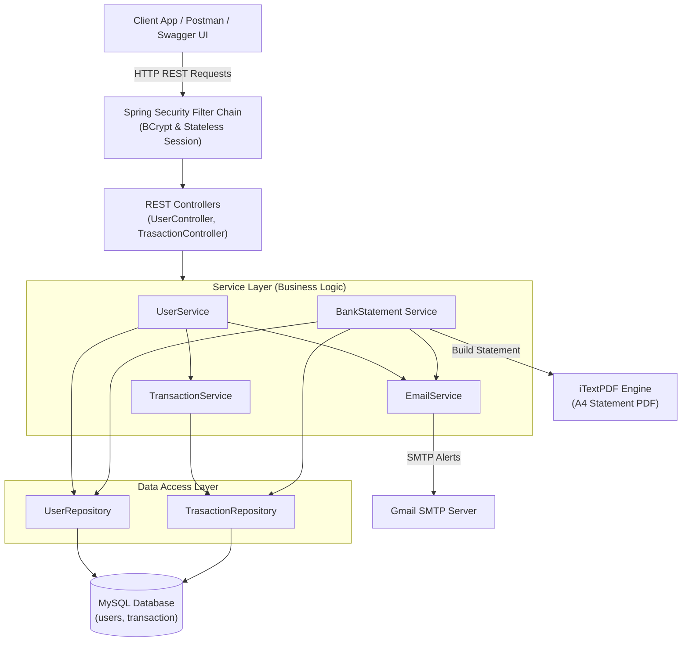
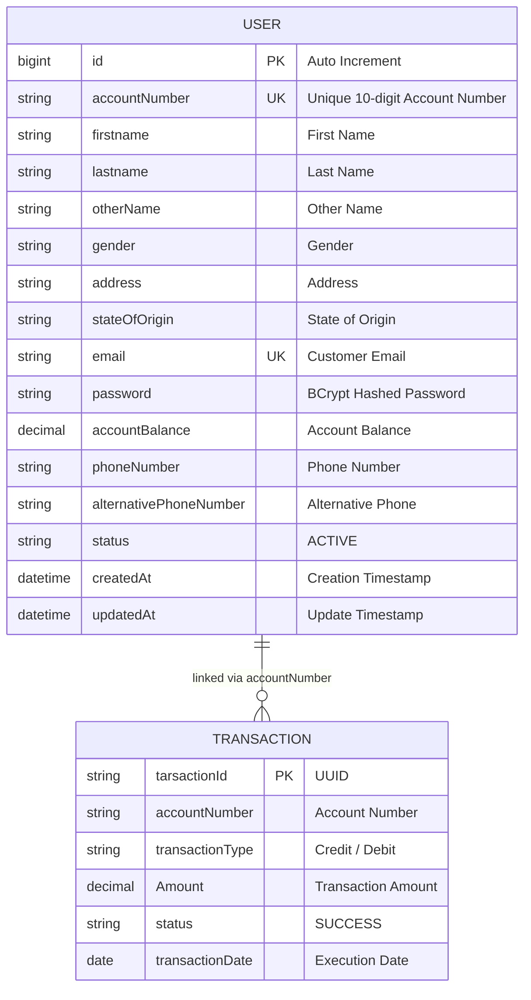
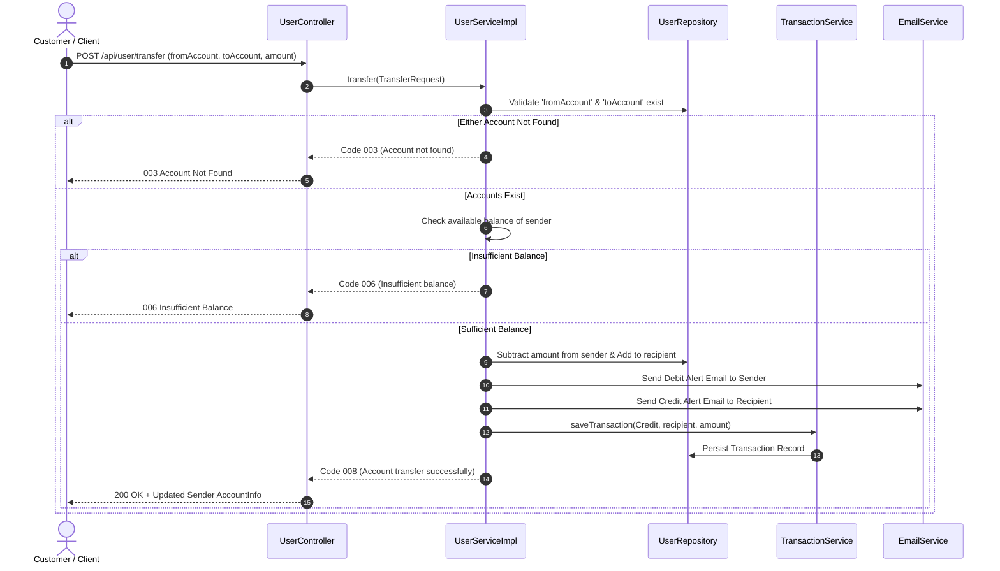
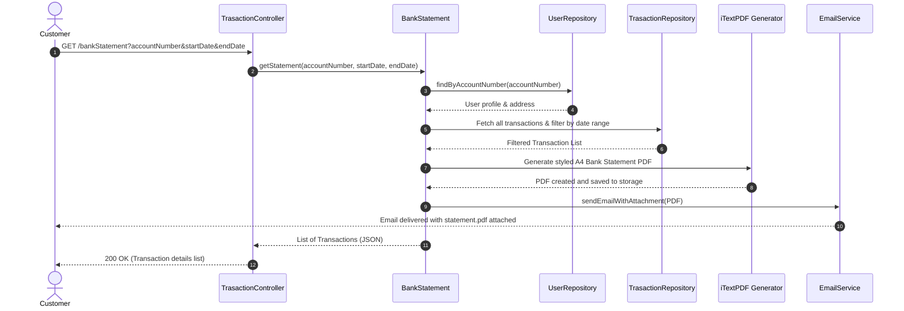

# Bank API - Core Banking RESTful Service

A robust, secure, and production-ready **Core Banking REST API** built with **Java 17**, **Spring Boot 3**, and **MySQL**. This application provides essential banking capabilities including customer registration, automated account number generation, fund deposits, withdrawals, intra-bank transfers, real-time email notifications, and automated PDF bank statement generation with email attachments.

---

## Table of Contents

- [System Architecture & Visual Flows](#system-architecture--visual-flows)
  - [High-Level Architecture](#1-high-level-system-architecture)
  - [Entity-Relationship Diagram (ERD)](#2-entity-relationship-diagram-erd)
  - [Fund Transfer Workflow](#3-fund-transfer-sequence-workflow)
  - [Bank Statement Generation Workflow](#4-bank-statement-generation--email-dispatch)
- [Features](#features)
- [Tech Stack](#tech-stack)
- [Architecture & Project Structure](#architecture--project-structure)
- [Database Schema & Entities](#database-schema--entities)
- [API Endpoints & Documentation](#api-endpoints--documentation)
  - [User Account APIs (`/api/user`)](#1-user-account-management-apiuser)
  - [Bank Statement APIs (`/bankStatement`)](#2-bank-statement-generation-bankstatement)
- [Standard Response Codes](#standard-response-codes)
- [Configuration & Setup](#configuration--setup)
- [Running the Application](#running-the-application)
- [API Testing & Swagger UI](#api-testing--swagger-ui)
- [Security](#security)

---

## System Architecture & Visual Flows

### 1. High-Level System Architecture


---

### 2. Entity-Relationship Diagram (ERD)


---

### 3. Fund Transfer Sequence Workflow


---

### 4. Bank Statement Generation & Email Dispatch


---

## Features

- **Customer Onboarding & Account Creation**:
  - Automatically generates a unique 10-digit account number composed of the current year (e.g., `2026`) and a 6-digit random number.
  - Securely hashes user passwords using `BCrypt`.
  - Dispatches an automated onboarding email containing account details.
- **Account Balance & Name Enquiry**:
  - Check account balance and holder identity by account number.
- **Deposit (Credit) & Withdrawal (Debit)**:
  - Safely deposit and withdraw money with balance verification and transaction history tracking.
- **Intra-Bank Fund Transfers**:
  - Validates sender and recipient accounts.
  - Checks available balance before processing.
  - Records debit/credit transactions in real time.
  - Dispatches automated debit/credit email alerts to both sender and recipient.
- **Automated PDF Bank Statement Generation**:
  - Generates branded, styled PDF statements for any given date range using **iTextPDF**.
  - Automatically sends the PDF as an attachment to the account owner's registered email address.
- **Interactive API Documentation**:
  - Integrated with **SpringDoc OpenAPI (Swagger UI)** for live testing and documentation.

---

## Tech Stack

| Technology | Purpose |
| :--- | :--- |
| **Java 17** | Core programming language |
| **Spring Boot 3.5.7** | Core application framework |
| **Spring Data JPA (Hibernate)** | Object-Relational Mapping (ORM) and data persistence |
| **Spring Web (MVC)** | RESTful API controllers and request routing |
| **Spring Security** | Application security, BCrypt password hashing, and stateless configuration |
| **Spring Mail (JavaMailSender)** | Transactional email delivery and PDF attachment dispatch |
| **MySQL** | Relational database management system |
| **iTextPDF 5.5.13** | Dynamic PDF document generator for bank statements |
| **SpringDoc OpenAPI 2.6.0** | Swagger UI and OpenAPI 3 documentation |
| **Project Lombok** | Boilerplate code reduction (getters, setters, builders) |
| **Maven** | Dependency management and build tool |

---

## Architecture & Project Structure

The project follows a standard multi-tiered Spring Boot architecture:

```
BankApi/
└── Bank/
    ├── pom.xml
    └── src/
        ├── main/
        │   ├── java/com/example/Bank/
        │   │   ├── BankApplication.java       # Main Spring Boot Entry Point
        │   │   ├── config/
        │   │   │   └── SecurityConfig.java     # Spring Security & PasswordEncoder configuration
        │   │   ├── controller/
        │   │   │   ├── UserController.java     # User Account endpoints
        │   │   │   └── TrasactionController.java # Bank Statement & PDF generation endpoints
        │   │   ├── dto/                        # Data Transfer Objects (DTOs)
        │   │   │   ├── AccountInfo.java
        │   │   │   ├── BankResponse.java
        │   │   │   ├── CreditDebitReqest.java
        │   │   │   ├── EmailDetails.java
        │   │   │   ├── EnquiryRequest.java
        │   │   │   ├── TransactionDto.java
        │   │   │   ├── TransferRequest.java
        │   │   │   └── UserRequest.java
        │   │   ├── entity/                     # JPA Entities
        │   │   │   ├── User.java               # Customer & account records
        │   │   │   └── Trasaction.java         # Financial transaction records
        │   │   ├── repository/                 # Data access repositories
        │   │   │   ├── UserRepository.java
        │   │   │   └── TrasactionRepository.java
        │   │   ├── service/impl/               # Service layer & business logic
        │   │   │   ├── BankStatement.java      # PDF generation & email attachment logic
        │   │   │   ├── EmailService.java & EmailServiceImpl.java
        │   │   │   ├── TransactionService.java & TransactionServiceImpl.java
        │   │   │   └── UserService.java & UerServiceImpl.java
        │   │   └── utils/
        │   │       └── AccountUtils.java       # Response codes, messages & account generation
        │   └── resources/
        │       └── application.properties      # DB connection, JPA & Mail configuration
        └── test/
            └── java/com/example/Bank/
                └── BankApplicationTests.java   # Integration & unit tests
```

---

## Database Schema & Entities

### 1. `users` Table
| Column | Type | Description |
| :--- | :--- | :--- |
| `id` | `BIGINT AUTO_INCREMENT PRIMARY KEY` | Internal user ID |
| `Firstname`, `Lastname`, `otherName` | `VARCHAR` | User legal names |
| `Gender` | `VARCHAR` | Gender |
| `address`, `stateOfOrigin` | `VARCHAR` | Residential address & origin |
| `accountNumber` | `VARCHAR UNIQUE` | Unique 10-digit generated account number |
| `accountBalance` | `DECIMAL` | Current account balance |
| `email` | `VARCHAR UNIQUE` | Customer email |
| `password` | `VARCHAR` | BCrypt encrypted password |
| `PhoneNumber`, `alternativePhoneNumber` | `VARCHAR` | Contact phone numbers |
| `status` | `VARCHAR` | Account status (e.g., `ACTIVE`) |
| `createdAt`, `updatedAt` | `DATETIME` | Audit timestamps |

### 2. `transaction` Table
| Column | Type | Description |
| :--- | :--- | :--- |
| `tarsactionId` | `VARCHAR PRIMARY KEY` | Generated UUID transaction identifier |
| `transactionType` | `VARCHAR` | Type: `Credit` or `Debit` |
| `Amount` | `DECIMAL` | Transaction monetary value |
| `accountNumber` | `VARCHAR` | Associated account number |
| `status` | `VARCHAR` | Transaction status (`SUCCESS`) |
| `transactionDate` | `DATE` | Execution date |

---

## API Endpoints & Documentation

### 1. User Account Management (`/api/user`)

#### Create Account
- **Endpoint:** `POST /api/user/create`
- **Access:** Public (PermitAll)
- **Request Body:**
```json
{
  "firstname": "Hazem",
  "lastname": "Saeed",
  "otherName": "Ali",
  "gender": "Male",
  "address": "Cairo, Egypt",
  "stateOfOrigin": "Cairo",
  "email": "user@example.com",
  "password": "StrongPassword123!",
  "phoneNumber": "+201000000000",
  "alternativePhoneNumber": "+201100000000"
}
```
- **Response:**
```json
{
  "responseCode": "002",
  "responseMessage": "Account created successfully",
  "accountInfo": {
    "accountName": "Hazem Saeed",
    "accountBalance": 0,
    "accountNumber": "2026123456"
  }
}
```

---

#### Balance Enquiry
- **Endpoint:** `GET /api/user/enquiry`
- **Request Body:**
```json
{
  "accountNumber": "2026123456"
}
```
- **Response:**
```json
{
  "responseCode": "004",
  "responseMessage": "Account found",
  "accountInfo": {
    "accountName": "Hazem Saeed",
    "accountBalance": 1500.00,
    "accountNumber": "2026123456"
  }
}
```

---

#### Name Enquiry
- **Endpoint:** `GET /api/user/nameEnquiry`
- **Request Body:**
```json
{
  "accountNumber": "2026123456"
}
```
- **Response:**
```text
Hazem Saeed Ali
```

---

#### Credit Account (Deposit)
- **Endpoint:** `POST /api/user/credit`
- **Request Body:**
```json
{
  "accountNumber": "2026123456",
  "amount": 5000.00
}
```
- **Response:**
```json
{
  "responseCode": "005",
  "responseMessage": "Account credited successfully",
  "accountInfo": {
    "accountName": "Hazem Saeed",
    "accountBalance": 5000.00,
    "accountNumber": "2026123456"
  }
}
```

---

#### Debit Account (Withdraw)
- **Endpoint:** `POST /api/user/debit`
- **Request Body:**
```json
{
  "accountNumber": "2026123456",
  "amount": 1000.00
}
```
- **Response:**
```json
{
  "responseCode": "007",
  "responseMessage": "Account debited successfully",
  "accountInfo": {
    "accountName": "Hazem Saeed",
    "accountBalance": 4000.00,
    "accountNumber": "2026123456"
  }
}
```

---

#### Transfer Funds
- **Endpoint:** `POST /api/user/transfer`
- **Request Body:**
```json
{
  "fromAccountNumber": "2026123456",
  "toAccountNumber": "2026654321",
  "amount": 1500.00
}
```
- **Response:**
```json
{
  "responseCode": "008",
  "responseMessage": "Account transfer successfully",
  "accountInfo": {
    "accountName": "Hazem Saeed",
    "accountBalance": 2500.00,
    "accountNumber": "2026123456"
  }
}
```

---

### 2. Bank Statement Generation (`/bankStatement`)

#### Generate PDF Statement & Send Email
- **Endpoint:** `GET /bankStatement`
- **Query Parameters:**
  - `accountNumber`: Account number (e.g. `2026123456`)
  - `startDate`: Start date format `YYYY-MM-DD` (e.g. `2026-01-01`)
  - `endDate`: End date format `YYYY-MM-DD` (e.g. `2026-12-31`)
- **Process:**
  1. Filters transactions within the requested date window.
  2. Generates a branded A4 PDF bank statement with customer details and table of transactions.
  3. Sends an email to the user with the statement PDF as an attachment.
  4. Returns the transactions as a JSON list.

---

## Standard Response Codes

Defined in `AccountUtils`:

| Code | Message | Description |
| :--- | :--- | :--- |
| `001` | `Account already exists` | Attempted to register with an existing email |
| `002` | `Account created successfully` | Registration succeeded |
| `003` | `Account not found` | The requested account number does not exist |
| `004` | `Account found` | Account inquiry succeeded |
| `005` | `Account credited successfully` | Deposit operation succeeded |
| `006` | `Insufficient balance` | Attempted withdrawal/transfer exceeded current balance |
| `007` | `Account debited successfully` | Withdrawal operation succeeded |
| `008` | `Account transfer successfully` | Intra-bank transfer succeeded |

---

## Configuration & Setup

### Prerequisites
- **JDK 17** or later installed
- **MySQL Server** running
- **Maven** (or use the included `./mvnw`)

### Database Setup
Create the MySQL database:
```sql
CREATE DATABASE bank;
```

### Application Properties
Located at `Bank/src/main/resources/application.properties`:
```properties
spring.application.name=Bank

# MySQL Database Configuration
spring.datasource.url=jdbc:mysql://localhost:3306/bank
spring.datasource.username=root
spring.datasource.password=YOUR_MYSQL_PASSWORD
spring.datasource.driver-class-name=com.mysql.cj.jdbc.Driver
spring.jpa.hibernate.ddl-auto=update

# Gmail SMTP Mail Configuration
spring.mail.host=smtp.gmail.com
spring.mail.port=587
spring.mail.username=your-email@gmail.com
spring.mail.password=your-app-password
spring.mail.properties.mail.smtp.auth=true
spring.mail.properties.mail.smtp.starttls.enable=true
spring.mail.properties.mail.smtp.starttls.required=true
```

> [!NOTE]
> Make sure to update `FILE_PATH` in `BankStatement.java` to a valid directory path on your operating system where generated PDF statements will be stored.

---

## Running the Application

Navigate to the `Bank` directory and run:

### Windows (cmd / PowerShell):
```powershell
cd Bank
.\mvnw.cmd spring-boot:run
```

### Linux / macOS:
```bash
cd Bank
./mvnw spring-boot:run
```

The application will start on **`http://localhost:8080`**.

---

## API Testing & Swagger UI

Once the application is running, access the interactive Swagger UI documentation at:
- **Swagger UI:** [http://localhost:8080/swagger-ui/index.html](http://localhost:8080/swagger-ui/index.html)
- **OpenAPI JSON:** [http://localhost:8080/v3/api-docs](http://localhost:8080/v3/api-docs)

---

## Security

- **Password Hashing:** Passwords are encrypted using `BCryptPasswordEncoder` prior to database insertion.
- **Session Management:** Stateless session policy configured via Spring Security.
- **Public vs Protected:** `/api/user/create` is openly accessible for registration; other endpoints are secured behind Spring Security authorization filters.
